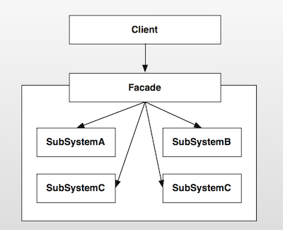
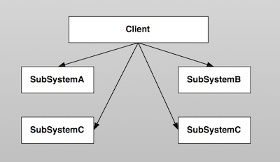

Android设计模式源码解析之外观模式(Facade)
====================================
> 本文为 [Android 设计模式源码解析](https://github.com/simple-android-framework-exchange/android_design_patterns_analysis) 中 外观模式 分析  
> Android系统版本： 2.3         
> 分析者：[elsdnwn](https://github.com/elsdnwn)、[Mr.Simple](https://github.com/bboyfeiyu)，分析状态：已完成，校对者：[Mr.Simple](https://github.com/bboyfeiyu)，校对状态：未开始   


## 1. 模式介绍  
 
###  模式的定义
外观模式(也成为门面模式)要求一个子系统的外部与其内部的通信必须通过一个统一的对象进行。它提供一个高层次的接口，使得子系统更易于使用。

### 模式的使用场景
1. 在设计初期阶段，将不同的两个层分离；
2. 在开发阶段，子系统往往因为不断的重构演化而变得越来越复杂，大多数的模式使用时也都会产生很多很小的类，这本是好事，但也给外部调用它们的用户程序带来了使用上的困难，增加外观Facade可以提供一个简单的接口，减少它们之间的依赖。
3. 在维护一个遗留的大型系统时，可能这个系统已经非常难以维护和扩展了，但因为它包含非常重要的功能，新的需求开发必须依赖于它。

## 2. UML类图
 

### 角色介绍
* Client : 客户端程序。
* Facade : 对外的统一入口,即外观对象。
* SubSystemA : 子系统A。
* SubSystemB : 子系统B。
* SubSystemC : 子系统C。
* SubSystemD : 子系统D。

## 不使用外观模式
      
如上述所说，门面模式提供一个高层次的接口，使得子系统更易于使用。因此在不使用该模式的情况下，客户端程序使用相关功能的成本就会比较的复杂，需要和各个子系统进行交互 ( 如上图 )，这样就使得系统的稳定性受到影响，用户的使用成本也相对较高。      


## 3. 模式的简单实现
###  简单实现的介绍
电视遥控器是现实生活中一个比较好的外观模式的运用，遥控器可以控制电源的开源、声音的调整、频道的切换等。这个遥控器就是我们这里说的外观或者门面，而电源、声音、频道切换系统就是我们的子系统。遥控器统一对这些子模块的控制，我想你没有用过多个遥控器来分别控制电源开关、声音控制等功能。下面我们就来简单模拟一下这个系统。     

### 实现源码
TvController.java   

```
public class TvController {
    private PowerSystem mPowerSystem = new PowerSystem();
    private VoiceSystem mVoiceSystem = new VoiceSystem();
    private ChannelSystem mChannelSystem = new ChannelSystem();

    public void powerOn() {
        mPowerSystem.powerOn();
    }

    public void powerOff() {
        mPowerSystem.powerOff();
    }

    public void turnUp() {
        mVoiceSystem.turnUp();
    }

    public void turnDown() {
        mVoiceSystem.turnDown();
    }

    public void nextChannel() {
        mChannelSystem.next();
    }

    public void prevChannel() {
        mChannelSystem.prev();
    }
}
```
PowerSystem.java

```java
/**
 * 电源控制系统
 */
 class PowerSystem {
    public void powerOn() {
        System.out.println("开机");
    }

    public void powerOff() {
        System.out.println("关机");
    }
}
```

VoiceSystem.java

```java
/**
 * 声音控制系统
 */
class VoiceSystem {
    public void turnUp() {
        System.out.println("音量增大");
    }

    public void turnDown() {
        System.out.println("音量减小");
    }
}
```


ChannelSystem.java

```java
/**
 * 频道控制系统
 */
class ChannelSystem {
    public void next() {
        System.out.println("下一频道");
    }

    public void prev() {
        System.out.println("上一频道");
    }
}
```

测试代码 :     

```java
public class TvController {
    private PowerSystem mPowerSystem = new PowerSystem();
    private VoiceSystem mVoiceSystem = new VoiceSystem();
    private ChannelSystem mChannelSystem = new ChannelSystem();

    public void powerOn() {
        mPowerSystem.powerOn();
    }

    public void powerOff() {
        mPowerSystem.powerOff();
    }

    public void turnUp() {
        mVoiceSystem.turnUp();
    }

    public void turnDown() {
        mVoiceSystem.turnDown();
    }

    public void nextChannel() {
        mChannelSystem.next();
    }

    public void prevChannel() {
        mChannelSystem.prev();
    }
}

``` 

输出结果：   

```
开机
下一频道
音量增大
关机
``` 
上面的TvController封装了对电源、声音、频道切换的操作，为用户提供了一个统一的接口。使得用户控制电视机更加的方便、更易于使用。        

## Android源码中的模式实现
在Android源码中，ContextImpl这个类封装了很多模块（子系统），比如startActivity()、sendBroadcast()等，分别给用户一个统一的操作入口，简单实例如下：

```
package com.elsdnwn.Facade;

import android.app.Activity;
import android.content.Intent;
import android.os.Bundle;

public class MainActivity extends Activity {
	
	@Override
	protected void onCreate(Bundle savedInstanceState) {
		super.onCreate(savedInstanceState);
		setContentView(R.layout.activity_main);

		Intent intent = new Intent();
		intent.setClass(this, MainActivity2.class);
		startActivity(intent);
	}

}

```

通过上面的代码可以看到，启动startActivity需要传递一个Context上下文对象，为什么要传递呢？下面我们看一下ContextImpl相关源码：

```

	@Override
    public void startActivity(Intent intent) {
        if ((intent.getFlags()&Intent.FLAG_ACTIVITY_NEW_TASK) == 0) {
            throw new AndroidRuntimeException(
                    "Calling startActivity() from outside of an Activity "
                    + " context requires the FLAG_ACTIVITY_NEW_TASK flag."
                    + " Is this really what you want?");
        }

		// 其实是用的getInstrumentation().execStartActivity();
        mMainThread.getInstrumentation().execStartActivity(
            getOuterContext(), mMainThread.getApplicationThread(), null,
            (Activity)null, intent, -1);
    }

```

我们可以看出启动Activity其实是用的Instrumentation()类里的getInstrumentation().execStartActivity(); 继续查看Instrumentation类里的execStartActivity()的源码：

```

	/**
	 * 需要接受一个Context上下文对象来确定activity的开始
	 */
	public ActivityResult execStartActivity(
            Context who, IBinder contextThread, IBinder token, Activity target,
            Intent intent, int requestCode, Bundle options) {
        IApplicationThread whoThread = (IApplicationThread) contextThread;
        if (mActivityMonitors != null) {
            synchronized (mSync) {
                final int N = mActivityMonitors.size();
                for (int i=0; i<N; i++) {
                    final ActivityMonitor am = mActivityMonitors.get(i);
                    if (am.match(who, null, intent)) {
                        am.mHits++;
                        if (am.isBlocking()) {
                            return requestCode >= 0 ? am.getResult() : null;
                        }
                        break;
                    }
                }
            }
        }
        // 代码略...
        return null;
    }

```

通过上面的代码可以看出启动Activity需要传递一个上下文Context才可以，通过外观模式我们不需要知道startActivity是怎么启动的，只需要传递上下文Context，这样就大大降低了客户端与子系统的耦合。


## 4. 杂谈
### 优点与缺点
#### 优点  
* 使用方便，使用外观模式客户端完全不需要知道子系统的实现过程；
* 降低客户端与子系统的耦合；
* 更好的划分访问层次；

#### 缺点 
* 减少了可变性和灵活性；
* 在不引入抽象外观类的情况下，增加新的子系统可能需要修改外观类或客户端的源代码，违背了“开闭原则”；


