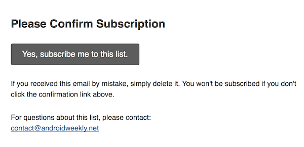

Android设计模式源码解析之观察者模式 
====================================
> 本文为 [Android 设计模式源码解析](https://github.com/simple-android-framework/android_design_patterns_analysis) 中 观察者模式 分析  
> Android系统版本： 2.3         
> 分析者：[Mr.Simple](https://github.com/bboyfeiyu)，分析状态：未完成，校对者：[Mr.Simple](https://github.com/bboyfeiyu)，校对状态：未开始   
 

## 1. 模式介绍  
 
###  模式的定义
定义对象间一种一对多的依赖关系，使得每当一个对象改变状态，则所有依赖于它的对象都会得到通知并被自动更新。


### 模式的使用场景
* 关联行为场景。需要注意的是，关联行为是可拆分的，而不是“组合”关系；
* 事件多级触发场景；
* 跨系统的消息交换场景，如消息队列、事件总线的处理机制。
 

## 2. UML类图
 

### 角色介绍
* 抽象主题 (Subject) 角色      
抽象主题角色把所有观察者对象的引用保存在一个聚集（比如ArrayList对象）里，每个主题都可以有任意数量的观察者。抽象主题提供一个接口，可以增加和删除观察者对象，抽象主题角色又叫做抽象被观察者(Observable)角色。

* 具体主题 (ConcreteSubject) 角色     
将有关状态存入具体观察者对象；在具体主题的内部状态改变时，给所有登记过的观察者发出通知。具体主题角色又叫做具体被观察者(Concrete Observable)角色。

* 抽象观察者 (Observer) 角色    
为所有的具体观察者定义一个接口，在得到主题的通知时更新自己，这个接口叫做更新接口。

* 具体观察者 (ConcreteObserver) 角色     
存储与主题的状态自恰的状态。具体观察者角色实现抽象观察者角色所要求的更新接口，以便使本身的状态与主题的状态 像协调。如果需要，具体观察者角色可以保持一个指向具体主题对象的引用。


## 3. 模式的简单实现
###  简单实现的介绍
[AndroidWeekly](http://androidweekly.net/)是一个每周都会发布关于Android新技术、开源库、招聘信息等内容的网站，在这里我们可以看到最新的技术，最牛X的工程师，经常逛逛这类网站不仅能够开阔我们的眼界，也能让我们接触到最前言的科技信息。这其实就是一个RSS系统，用户订阅Android Weekly的文章，每当有更新的时候将新的内容推送给订阅用户。这不就是观察者模式吗？观察者模式的另一个名字叫做发布-订阅模式，下图就是我订阅AndroidWeekly之后他们发来的确认邮件。下面让我们来简单模拟一下AndroidWeekly的发布过程吧！       


### 实现源码

```
/**
 * 程序员是观察者
 * 
 * @author mrsimple
 */
public class Coder implements Observer {
    public String name ;
    
    public Coder(String aName) {
        name = aName ;
    }
    
    @Override
    public void update(Observable o, Object arg) {
        System.out.println( "Hi, " +  name + ", AndroidWeekly更新啦, 内容 : " + arg);
    }
    
    @Override
    public String toString() {
        return "码农 : " + name;
    }

}


/**
 * AndroidWeekly这个网站是被观察者,它有更新所有的观察者 (这里是程序员) 都会接到相应的通知.
 * 
 * @author mrsimple
 */
public class AndroidWeekly extends Observable {

    public void postNewPublication(String content) {
    	// 标识状态或者内容发生改变
        setChanged();
        // 通知所有观察者
        notifyObservers(content);
    }
}

// 测试代码
public class Test {
    public static void main(String[] args) {
        // 被观察的角色
        AndroidWeekly androidWeekly = new AndroidWeekly();
        // 观察者
        Coder mrsimple = new Coder("mr.simple");
        Coder coder1 = new Coder("coder-1");
        Coder coder2 = new Coder("coder-2");
        Coder coder3 = new Coder("coder-3");

        // 将观察者注册到可观察对象的观察者列表中
        androidWeekly.addObserver(mrsimple);
        androidWeekly.addObserver(coder1);
        androidWeekly.addObserver(coder2);
        androidWeekly.addObserver(coder3);

        // 发布消息
        androidWeekly.postNewPublication("新的一期AndroidWeekly来啦!");
    }

}

```

输入结果: 

```
Hi, coder-3, AndroidWeekly更新啦, 内容 : 新的一期AndroidWeekly来啦!
Hi, coder-2, AndroidWeekly更新啦, 内容 : 新的一期AndroidWeekly来啦!
Hi, coder-1, AndroidWeekly更新啦, 内容 : 新的一期AndroidWeekly来啦!
Hi, mr.simple, AndroidWeekly更新啦, 内容 : 新的一期AndroidWeekly来啦!
```
  
可以看到所有订阅了AndroidWeekly的用户都受到了更新消息，一对多的订阅-发布系统这么简单就完成了。      

这里Observer是抽象的观察者角色，Coder扮演的是具体观察者的角色；Observable对应的是抽象主题角色，AndroidWeekly则是具体的主题角色。Coder是具体的观察者，他们订阅了AndroidWeekly这个具体的可观察对象，当AndroidWeekly有更新时，会遍历所有观察者 ( 这里是Coder码农 )，然后给这些观察者发布一个更新的消息，即调用Coder中的update方法，这样就达到了1对多的通知功能。Observer和Observable都已经内置在jdk中，可见观察者模式在java中的重要性。       


## Android源码中的模式实现
ListView是Android中最重要的控件，没有之一。而ListView最重要的一个点就是Adapter，在[Android设计模式源码解析之适配器(Adapter)模式](../../adapter/mr.simple)中我们分析了Adapter模式，在我们往ListView添加数据后，我们都会调用一个方法: notifyDataSetChanged(), 这是为什么呢？  今天我们就来揭开它的神秘面纱。       

第一步我们就跟进这个方法notifyDataSetChanged方法，这个方法定义在BaseAdapter中，代码如下: 

```
public abstract class BaseAdapter implements ListAdapter, SpinnerAdapter {
	// 数据集观察者
    private final DataSetObservable mDataSetObservable = new DataSetObservable();

    // 代码省略
    
    public void registerDataSetObserver(DataSetObserver observer) {
        mDataSetObservable.registerObserver(observer);
    }

    public void unregisterDataSetObserver(DataSetObserver observer) {
        mDataSetObservable.unregisterObserver(observer);
    }
    
    /**
     * Notifies the attached observers that the underlying data has been changed
     * and any View reflecting the data set should refresh itself.
     * 当数据集用变化时通知所有观察者
     */
    public void notifyDataSetChanged() {
        mDataSetObservable.notifyChanged();
    }
}

```

我们一看BaseAdapter上述代码，大体有了这么一个了解，原来BaseAdapter是一个观察者模式！      
那么BaseAdapter是如何运作的？ 这些观察者又是什么呢？我们一步一步来分析。     

我们先跟到mDataSetObservable.notifyChanged()函数中看看。     

```
/**
 * A specialization of Observable for DataSetObserver that provides methods for
 * invoking the various callback methods of DataSetObserver.
 */
public class DataSetObservable extends Observable<DataSetObserver> {
    /**
     * Invokes onChanged on each observer. Called when the data set being observed has
     * changed, and which when read contains the new state of the data.
     */
    public void notifyChanged() {
        synchronized(mObservers) {
            // 调用所有观察者的onChanged方式
            for (int i = mObservers.size() - 1; i >= 0; i--) {
                mObservers.get(i).onChanged();
            }
        }
    }
	// 代码省略
}
```      
恩，代码很简单，就是在mDataSetObservable.notifyChanged()中遍历所有观察者，并且调用它们的onChanged方法。        
 
那么这些观察者是从哪里来的呢？首先ListView通过setAdapter方法来设置Adapter,我们看看相关代码。     

```
    @Override
    public void setAdapter(ListAdapter adapter) {
    	// 如果已经有了一个adapter,那么先注销该Adapter对应的观察者
        if (mAdapter != null && mDataSetObserver != null) {
            mAdapter.unregisterDataSetObserver(mDataSetObserver);
        }

     	// 代码省略

        super.setAdapter(adapter);

        if (mAdapter != null) {
            mAreAllItemsSelectable = mAdapter.areAllItemsEnabled();
            mOldItemCount = mItemCount;
            // 获取数据的数量
            mItemCount = mAdapter.getCount();
            checkFocus();
			// 注意这里 : 创建一个一个数据集观察者
            mDataSetObserver = new AdapterDataSetObserver();
            // 将这个观察者注册到Adapter中，实际上是注册到DataSetObservable中
            mAdapter.registerDataSetObserver(mDataSetObserver);

   			// 代码省略
        } else {
            // 代码省略
        }

        requestLayout();
    }
```
可以看到在设置Adapter时会构建一个AdapterDataSetObserver，这不就是我们上面所说的观察者么，最后将这个观察者注册到adapter中，这样我们的被观察者、观察者都有了。一般来说我们的数据集会放到Adapter中，例如 :     

```
public abstract class UserAdapter extends BaseAdapter {
	// 数据集
    protected List<String> mDataSet = new LinkedList<String>();
    protected Context mContext = null;

    public CommonAdapter(Context context, List<String> dataSet) {
        this.mDataSet = dataSet;
        this.mContext = context;
    }
}
```
这个时候可能你就有点晕了？  AdapterDataSetObserver是什么？它是如何运作的？那么我就先来看看AdapterDataSetObserver吧。       
 
AdapterDataSetObserver定义在ListView的父类AbsListView中，代码如下 :    

```
    class AdapterDataSetObserver extends AdapterView<ListAdapter>.AdapterDataSetObserver {
        @Override
        public void onChanged() {
            super.onChanged();
            if (mFastScroller != null) {
                mFastScroller.onSectionsChanged();
            }
        }

        @Override
        public void onInvalidated() {
            super.onInvalidated();
            if (mFastScroller != null) {
                mFastScroller.onSectionsChanged();
            }
        }
    }
```     
它由继承自AbsListView的父类AdapterView<T>的AdapterDataSetObserver, 代码如下 : 

```
    class AdapterDataSetObserver extends DataSetObserver {

        private Parcelable mInstanceState = null;
		// 上文有说道，调用Adapter的notifyDataSetChanged的时候会调用所有观察者的onChanged方法,核心实现就在这里
        @Override
        public void onChanged() {
            mDataChanged = true;
            mOldItemCount = mItemCount;
            // 获取Adapter中数据的数量
            mItemCount = getAdapter().getCount();

            // Detect the case where a cursor that was previously invalidated has
            // been repopulated with new data.
            if (AdapterView.this.getAdapter().hasStableIds() && mInstanceState != null
                    && mOldItemCount == 0 && mItemCount > 0) {
                AdapterView.this.onRestoreInstanceState(mInstanceState);
                mInstanceState = null;
            } else {
                rememberSyncState();
            }
            checkFocus();
            // 重新布局ListView、GridView等AdapterView组件
            requestLayout();
        }

        // 代码省略

        public void clearSavedState() {
            mInstanceState = null;
        }
    }
```
到这里我们就知道了，当ListView的数据发生变化时，调用Adapter的notifyDataSetChanged函数，这个函数又会调用DataSetObservable的notifyChanged函数，这个函数会调用所有观察者 (AdapterDataSetObserver) 的onChanged方法。这就是一个观察者模式！         

**<font color="red">最后我们再捋一捋,AdapterView中有一个内部类AdapterDataSetObserver,在ListView设置Adapter时会构建一个AdapterDataSetObserver，并且注册到Adapter中，这个就是一个观察者。而Adapter中包含一个数据集可观察者DataSetObservable，在数据数量发生变更时开发者手动调用AdapternotifyDataSetChanged，而notifyDataSetChanged实际上会调用DataSetObservable的notifyChanged函数，该函数会遍历所有观察者的onChanged函数。在AdapterDataSetObserver的onChanged函数中会获取Adapter中数据集的新数量，然后调用ListView的requestLayout()方法重新进行布局，更新用户界面。</font>**       

| |  |
|----------------------------|-----------------------------|
|    		图1 				  |			  图2	             |      


## 4. 杂谈
ListView主要运用了Adapter和观察者模式使得可扩展性、灵活性非常强，而耦合度却很低，这是我认为设计模式在Android源码中优秀运用的典范。那么为什么Android架构师们会这么设计ListView，它们如何达到低耦合、高灵活性呢？这个留给大家思考吧，如果有时间我再分享我的看法。        

### 优点
* 观察者和被观察者之间是抽象耦合

### 缺点
* 观察者模式需要考虑一下开发效率和运行效率问题，一个被观察者，多个观察者，开发和调试就会比较复杂，而且在 Java 中消息的通知默认是顺序执行，一个观察者卡壳，会影响整体的执行效率。在这种情况下，一般考虑采用异步的方式。
