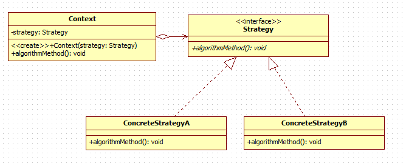
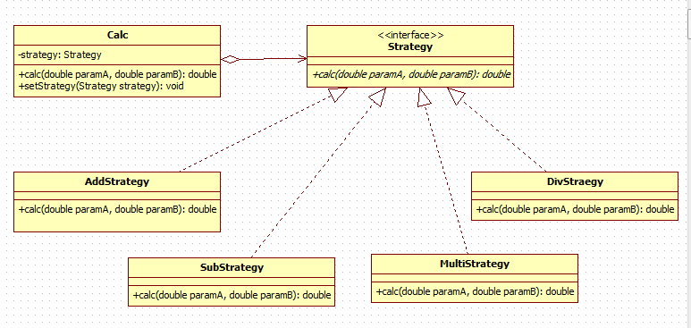

Android设计模式源码解析之策略模式 
====================================
> 本文为 [Android 设计模式源码解析](https://github.com/simple-android-framework/android_design_patterns_analysis) 中策略模式分析  
> Android系统版本：4.4.2         
> 分析者：[GKerison](https://github.com/GKerison)，分析状态：已完成，校对者：[Mr.Simple](https://github.com/bboyfeiyu)，校对状态：未开始   

## 1. 模式介绍  
 
###  模式的定义
**分离算法，选择实现**

`注：针对同一类型操作，将复杂多样的处理方式分别开来，有选择的实现各自特有的操作。`

### 模式的使用场景
* 针对同一类型问题的多种处理方式，仅仅是具体行为有差别时。
* 需要安全的封装多种同一类型的操作时。
* 出现同一抽象多个子类，而又需要使用if-else 或者 switch-case来选择时。
 

## 2. UML类图
  

### 角色介绍
* Context：用来操作策略的上下文环境。
* Strategy : 策略的抽象。
* ConcreteStrategyA、ConcreteStrategyB : 具体的策略实现。

## 3. 模式的简单实现
###  简单实现的介绍
通常如果一个问题有多个解决方案或者稍有区别的操作时，最简单的方式就是利用if-else or switch-case方式来解决，对于简单的解决方案这样做无疑是比较简单、方便、快捷的，但是如果解决方案中包括大量的处理逻辑需要封装，或者处理方式变动较大的时候则就显得混乱、复杂，而策略模式则很好的解决了这样的问题，它将各种方案分离开来，让操作者根据具体的需求来动态的选择不同的策略方案。
这里以简单的计算操作(+、-、*、/)作为示例：
### 未使用策略模式

	public static double calc(String op, double paramA, double paramB) {
		if ("+".equals(op)) {
			System.out.println("执行加法...");
			return paramA + paramB;
		} else if ("-".equals(op)) {
			System.out.println("执行减法...");
			return paramA - paramB;
		} else if ("*".equals(op)) {
			System.out.println("执行乘法...");
			return paramA * paramB;
		} else if ("/".equals(op)) {
			System.out.println("执行除法...");
			if (paramB == 0) {
				throw new IllegalArgumentException("除数不能为0!");
			}
			return paramA / paramB;
		} else {
			throw new IllegalArgumentException("未找到计算方法!");
		}
	}

### 使用策略模式
UML类图
  

* Calc：进行计算操作的上下文环境。
* Strategy : 计算操作的抽象。
* AddStrategy、SubStrategy、MultiStrategy、DivStrategy : 具体的 +、-、*、/ 实现。

具体实现代码如下：
 
	//针对操作进行抽象
	public interface Strategy {
		public double calc(double paramA, double paramB);
	}
	
	//加法的具体实现策略
	public class AddStrategy implements Strategy {
		@Override
		public double calc(double paramA, double paramB) {
			// TODO Auto-generated method stub
			System.out.println("执行加法策略...");
			return paramA + paramB;
		}
	}

	//减法的具体实现策略
	public class SubStrategy implements Strategy {
		@Override
		public double calc(double paramA, double paramB) {
			// TODO Auto-generated method stub
			System.out.println("执行减法策略...");
			return paramA - paramB;
		}
	}

	//乘法的具体实现策略
	public class MultiStrategy implements Strategy {
		@Override
		public double calc(double paramA, double paramB) {
			// TODO Auto-generated method stub
			System.out.println("执行乘法策略...");
			return paramA * paramB;
		}
	}

	//除法的具体实现策略
	public class DivStrategy implements Strategy {
		@Override
		public double calc(double paramA, double paramB) {
			// TODO Auto-generated method stub
			System.out.println("执行除法策略...");
			if (paramB == 0) {
				throw new IllegalArgumentException("除数不能为0!");
			}
			return paramA / paramB;
		}
	}

	//上下文环境的实现
	public class Calc {
		private Strategy strategy;
		public void setStrategy(Strategy strategy) {
			this.strategy = strategy;
		}
		
		public double calc(double paramA, double paramB) {
			// TODO Auto-generated method stub
			// doing something
			if (this.strategy == null) {
				throw new IllegalStateException("你还没有设置计算的策略");
			}
			return this.strategy.calc(paramA, paramB);
		}
	}

	//执行方法
	public static double calc(Strategy strategy, double paramA, double paramB) {
		Calc calc = new Calc();
		calc.setStrategy(strategy);
		return calc.calc(paramA, paramB);
	}

二者运行：

	public static void main(String[] args) {
		double paramA = 5;
		double paramB = 21;
		
		System.out.println("执行普通模式------------------------------");
		System.out.println("加法结果是：" + calc("+", paramA, paramB));
		System.out.println("减法结果是：" + calc("-", paramA, paramB));
		System.out.println("乘法结果是：" + calc("*", paramA, paramB));
		System.out.println("除法结果是：" + calc("/", paramA, paramB));
		
		System.out.println("执行策略模式------------------------------");
		System.out.println("加法结果是：" + calc(new AddStrategy(), paramA, paramB));
		System.out.println("减法结果是：" + calc(new SubStrategy(), paramA, paramB));
		System.out.println("乘法结果是：" + calc(new MultiStrategy(), paramA, paramB));
		System.out.println("除法结果是：" + calc(new DivStrategy(), paramA, paramB));
	}
结果为：

  

### 总结

通过简单的代码可以清晰的看出二者的优势所在，前者通过简单的if-else来解决问题，在解决简单问题事会更简单、方便，后者则是通过给予不同的具体策略来获取不同的结果，对于较为复杂的业务逻辑显得更为直观，扩展也更为方便。

## Android源码中的模式实现
日常的Android开发中经常会用到动画，而动画的多变性往往也取决于插值器Interpolator不同，我们只需要对Animation对象设置不同的Interpolator就可以实现不同的效果，这是怎么实现的呢？

通过查看Android源码，很容易发现Android系统中在处理动画的时候经常会涉及时间的问题，也就是动画当前时间和总的动画的时长之间的关系。系统内置了很多插值器，如图：

 

由于初期比较旧的版本采用的插值器是TimeInterpolator抽象，google采用了多加一层接口继承来实现兼容也不足为怪了。很显然这里的Interpolator就是处理动画时间的抽象。LinearInterpolator、CycleInterpolator等插值器就是具体的实现策略，如图：

 

在Animation中通过调用getTransformation方法来计算动画的实际效果，而getTransformation又是通过调用applyTransformation来应用实际的动画效果，具体代码如下：

	Interpolator mInterpolator;
	public boolean getTransformation(long currentTime, Transformation outTransformation) {
			//计算处理...
            final float interpolatedTime = mInterpolator.getInterpolation(normalizedTime);
            applyTransformation(interpolatedTime, outTransformation);
      		//后续处理...
        return mMore;
    }

## 4. 杂谈
策略模式主要用来分离算法，根据相同的行为抽象来做不同的具体策略实现。

通过以上也可以看出策略模式的优缺点：

优点：

* 结构清晰明了、使用简单直观。
* 耦合度相对而言较低，扩展方便。
* 操作封装也更为彻底，数据更为安全。

缺点：

* 随着策略的增加，子类也会变得繁多。

  

