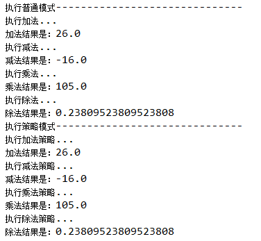
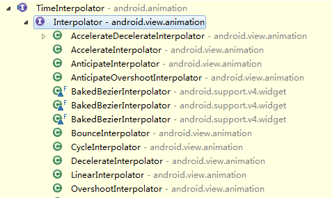
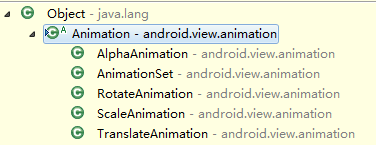
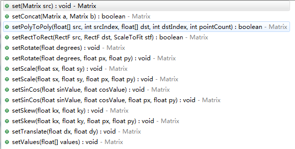

Android设计模式源码解析之策略模式 
====================================
> 本文为 [Android 设计模式源码解析](https://github.com/simple-android-framework/android_design_patterns_analysis) 中策略模式分析  
> Android系统版本：4.4.2         
> 分析者：[GKerison](https://github.com/GKerison)，分析状态：已完成，校对者：[Mr.Simple](https://github.com/bboyfeiyu)，校对状态：未开始   

## 1. 模式介绍  
 
###  模式的定义
**分离算法，选择实现**

`注：针对同一类型操作，将复杂多样的处理方式分别开来，有选择的实现各自特有的操作。`

### 模式的使用场景
* 针对同一类型问题的多种处理方式，仅仅是具体行为有差别时。
* 需要安全的封装多种同一类型的操作时。
* 出现同一抽象多个子类，而又需要使用if-else 或者 switch-case来选择时。
 

## 2. UML类图
  

### 角色介绍
* Context：用来操作策略的上下文环境。
* Strategy : 策略的抽象。
* ConcreteStrategyA、ConcreteStrategyB : 具体的策略实现。

## 3. 模式的简单实现
###  简单实现的介绍
通常如果一个问题有多个解决方案或者稍有区别的操作时，最简单的方式就是利用if-else or switch-case方式来解决，对于简单的解决方案这样做无疑是比较简单、方便、快捷的，但是如果解决方案中包括大量的处理逻辑需要封装，或者处理方式变动较大的时候则就显得混乱、复杂，而策略模式则很好的解决了这样的问题，它将各种方案分离开来，让操作者根据具体的需求来动态的选择不同的策略方案。
这里以简单的计算操作(+、-、*、/)作为示例：
### 未使用策略模式

	public static double calc(String op, double paramA, double paramB) {
		if ("+".equals(op)) {
			System.out.println("执行加法...");
			return paramA + paramB;
		} else if ("-".equals(op)) {
			System.out.println("执行减法...");
			return paramA - paramB;
		} else if ("*".equals(op)) {
			System.out.println("执行乘法...");
			return paramA * paramB;
		} else if ("/".equals(op)) {
			System.out.println("执行除法...");
			if (paramB == 0) {
				throw new IllegalArgumentException("除数不能为0!");
			}
			return paramA / paramB;
		} else {
			throw new IllegalArgumentException("未找到计算方法!");
		}
	}

### 使用策略模式
UML类图
  

* Calc：进行计算操作的上下文环境。
* Strategy : 计算操作的抽象。
* AddStrategy、SubStrategy、MultiStrategy、DivStrategy : 具体的 +、-、*、/ 实现。

具体实现代码如下：
 
	//针对操作进行抽象
	public interface Strategy {
		public double calc(double paramA, double paramB);
	}
	
	//加法的具体实现策略
	public class AddStrategy implements Strategy {
		@Override
		public double calc(double paramA, double paramB) {
			// TODO Auto-generated method stub
			System.out.println("执行加法策略...");
			return paramA + paramB;
		}
	}

	//减法的具体实现策略
	public class SubStrategy implements Strategy {
		@Override
		public double calc(double paramA, double paramB) {
			// TODO Auto-generated method stub
			System.out.println("执行减法策略...");
			return paramA - paramB;
		}
	}

	//乘法的具体实现策略
	public class MultiStrategy implements Strategy {
		@Override
		public double calc(double paramA, double paramB) {
			// TODO Auto-generated method stub
			System.out.println("执行乘法策略...");
			return paramA * paramB;
		}
	}

	//除法的具体实现策略
	public class DivStrategy implements Strategy {
		@Override
		public double calc(double paramA, double paramB) {
			// TODO Auto-generated method stub
			System.out.println("执行除法策略...");
			if (paramB == 0) {
				throw new IllegalArgumentException("除数不能为0!");
			}
			return paramA / paramB;
		}
	}

	//上下文环境的实现
	public class Calc {
		private Strategy strategy;
		public void setStrategy(Strategy strategy) {
			this.strategy = strategy;
		}
		
		public double calc(double paramA, double paramB) {
			// TODO Auto-generated method stub
			// doing something
			if (this.strategy == null) {
				throw new IllegalStateException("你还没有设置计算的策略");
			}
			return this.strategy.calc(paramA, paramB);
		}
	}

	//执行方法
	public static double calc(Strategy strategy, double paramA, double paramB) {
		Calc calc = new Calc();
		calc.setStrategy(strategy);
		return calc.calc(paramA, paramB);
	}

二者运行：

	public static void main(String[] args) {
		double paramA = 5;
		double paramB = 21;
		
		System.out.println("执行普通模式------------------------------");
		System.out.println("加法结果是：" + calc("+", paramA, paramB));
		System.out.println("减法结果是：" + calc("-", paramA, paramB));
		System.out.println("乘法结果是：" + calc("*", paramA, paramB));
		System.out.println("除法结果是：" + calc("/", paramA, paramB));
		
		System.out.println("执行策略模式------------------------------");
		System.out.println("加法结果是：" + calc(new AddStrategy(), paramA, paramB));
		System.out.println("减法结果是：" + calc(new SubStrategy(), paramA, paramB));
		System.out.println("乘法结果是：" + calc(new MultiStrategy(), paramA, paramB));
		System.out.println("除法结果是：" + calc(new DivStrategy(), paramA, paramB));
	}
结果为：

  

### 总结

通过简单的代码可以清晰的看出二者的优势所在，前者通过简单的if-else来解决问题，在解决简单问题事会更简单、方便，后者则是通过给予不同的具体策略来获取不同的结果，对于较为复杂的业务逻辑显得更为直观，扩展也更为方便。

## Android源码中的模式实现
日常的Android开发中经常会用到动画，而动画的多变性往往也取决于插值器Interpolator不同，我们只需要对Animation对象设置不同的Interpolator就可以实现不同的效果，这是怎么实现的呢？

通过查看Android源码，很容易发现Android系统中在处理动画的时候经常会涉及时间的问题，也就是动画当前时间和总的动画的时长之间的关系。系统内置了很多插值器，如图：

 

由于初期比较旧的版本采用的插值器是TimeInterpolator抽象，google采用了多加一层接口继承来实现兼容也不足为怪了。很显然这里的Interpolator就是处理动画时间的抽象。LinearInterpolator、CycleInterpolator等插值器就是具体的实现策略，如图：

 

在Animation中通过调用getTransformation方法来计算动画的实际效果，而getTransformation又是通过调用applyTransformation来应用实际的动画效果，具体代码如下：

	Interpolator mInterpolator;
	public boolean getTransformation(long currentTime, Transformation outTransformation) {
			//计算处理当前动画的时间点...
            final float interpolatedTime = mInterpolator.getInterpolation(normalizedTime);
			//后续处理，以此来应用动画效果...
            applyTransformation(interpolatedTime, outTransformation);
	    return mMore;
    }

默认是不做任何操作，由具体的子类动画来实现操作，可见附加分析里的操作。

 	protected void applyTransformation(float interpolatedTime, Transformation t) {
	}

## 4. 杂谈
策略模式主要用来分离算法，根据相同的行为抽象来做不同的具体策略实现。

通过以上也可以看出策略模式的优缺点：

优点：

* 结构清晰明了、使用简单直观。
* 耦合度相对而言较低，扩展方便。
* 操作封装也更为彻底，数据更为安全。

缺点：

* 随着策略的增加，子类也会变得繁多。

## 5.附加：Android 动画实现的基本原理解析

Android中最简单的动画就是Tween Animation了，当然帧动画和属性动画也挺方便的，但是基本原理都类似，毕竟动画的本质都是一帧一帧的展现给用户的，只不要当fps小于60的时候，人眼基本看不出间隔，也就成了所谓的流畅动画。（注：属性动画是3.0以后才有的，低版本可采用[NineOldAndroids](https://github.com/JakeWharton/NineOldAndroids)来兼容。
  
首先要想知道动画的执行流程，还是得从View入手，因为Android中主要针对的操作对象还是View，所以我们首先到View中查找，我们找到了View.startAnimation(Animation animation)这个方法

	public void startAnimation(Animation animation) {
		//初始化动画开始时间
        animation.setStartTime(Animation.START_ON_FIRST_FRAME);
		//对View设置动画
        setAnimation(animation); //赋值到-->mCurrentAnimation
		//刷新父类缓存
        invalidateParentCaches();
		//刷新View本身及子View
        invalidate(true);
    }

考虑到View一般不会单独存在，都是存在于某个ViewGroup中，所以google使用动画绘制的地方选择了在ViewGroup中的drawChild(Canvas canvas, View child, long drawingTime)方法中进行调用子View的绘制。
	
	protected boolean drawChild(Canvas canvas, View child, long drawingTime) {
        return child.draw(canvas, this, drawingTime);
    }

再看下View中的draw(Canvas canvas, ViewGroup parent, long drawingTime)方法中是如何调用使用Animation的

	boolean draw(Canvas canvas, ViewGroup parent, long drawingTime) {
		//...
		
		//查看是否需要清除动画信息
		final int flags = parent.mGroupFlags;
        if ((flags & ViewGroup.FLAG_CLEAR_TRANSFORMATION) == ViewGroup.FLAG_CLEAR_TRANSFORMATION) {
            parent.getChildTransformation().clear();
            parent.mGroupFlags &= ~ViewGroup.FLAG_CLEAR_TRANSFORMATION;
        }
	
		//获取设置的动画信息
	   	final Animation a = getAnimation();
        if (a != null) {
			//绘制动画
            more = drawAnimation(parent, drawingTime, a, scalingRequired);
            concatMatrix = a.willChangeTransformationMatrix();
            if (concatMatrix) {
                mPrivateFlags3 |= PFLAG3_VIEW_IS_ANIMATING_TRANSFORM;
            }
            transformToApply = parent.getChildTransformation();
        } else {
			//...
		}
	}

可以看出在父类调用View的draw方法中，会先判断是否设置了清除到需要做该表的标记，然后再获取设置的动画的信息，如果设置了动画，就会调用View中的drawAnimation方法，具体如下：

	private boolean drawAnimation(ViewGroup parent, long drawingTime,
            Animation a, boolean scalingRequired) {

  		Transformation invalidationTransform;
        final int flags = parent.mGroupFlags;
		//判断动画是否已经初始化过
        final boolean initialized = a.isInitialized();
        if (!initialized) {
            a.initialize(mRight - mLeft, mBottom - mTop, parent.getWidth(), parent.getHeight());
            a.initializeInvalidateRegion(0, 0, mRight - mLeft, mBottom - mTop);
            if (mAttachInfo != null) a.setListenerHandler(mAttachInfo.mHandler);
            onAnimationStart();
        }
		
		//判断View是否需要进行缩放
 		final Transformation t = parent.getChildTransformation();
        boolean more = a.getTransformation(drawingTime, t, 1f);
        if (scalingRequired && mAttachInfo.mApplicationScale != 1f) {
            if (parent.mInvalidationTransformation == null) {
                parent.mInvalidationTransformation = new Transformation();
            }
            invalidationTransform = parent.mInvalidationTransformation;
            a.getTransformation(drawingTime, invalidationTransform, 1f);
        } else {
            invalidationTransform = t;
        }

		if (more) {
			//根据具体实现，判断当前动画类型是否需要进行调整位置大小，然后刷新不同的区域
            if (!a.willChangeBounds()) {
				//...
 				
			}else{
				//...
			}
		}
		return more;
	}
其中主要的操作是动画始化、动画操作、界面刷新。动画的具体实现是调用了Animation中的getTransformation(long currentTime, Transformation outTransformation,float scale)方法，该方式主要是获取缩放系数。

  	public boolean getTransformation(long currentTime, Transformation outTransformation,
            float scale) {
        mScaleFactor = scale;
        return getTransformation(currentTime, outTransformation);
    }

在上面的方法中，又调用了插值器中分析提到的方法： Animation.getTransformation(long currentTime, Transformation outTransformation)，分析至此……大致就先这样吧。

最后来看一下Animation类的结构：

可以看出Animation的直接父类就是Object，直接子类除了AnimationSet（多个动画组成的一组动画效果，归根结底还是动画），其他几个子类都是Android内置的简单动画类型，从上面对插值器的分析中可以看出，Animation会调用applyTransformation来应用动画时间来达到动态效果。

例如：

1. AlphaAnimation 主要是针对View的alpha属性根据时间做了动态调整：
	
		@Override
	    protected void applyTransformation(float interpolatedTime, Transformation t) {
	        final float alpha = mFromAlpha;
	        t.setAlpha(alpha + ((mToAlpha - alpha) * interpolatedTime));
	    }

2. RotateAnimation 主要是针对View Matrix的角度值根据时间做了动态调整。

		@Override
	    protected void applyTransformation(float interpolatedTime, Transformation t) {
	        float degrees = mFromDegrees + ((mToDegrees - mFromDegrees) * interpolatedTime);
	        float scale = getScaleFactor();
	        //判断是否设置旋转中心
	        if (mPivotX == 0.0f && mPivotY == 0.0f) {
	            t.getMatrix().setRotate(degrees);
	        } else {
	            t.getMatrix().setRotate(degrees, mPivotX * scale, mPivotY * scale);
	        }
	    }
3. ScaleAnimation 主要是针对View Matrix的缩放值根据时间做了动态调整。

		@Override
	    protected void applyTransformation(float interpolatedTime, Transformation t) {
	        float sx = 1.0f;
	        float sy = 1.0f;
	        float scale = getScaleFactor();
			//判断X方向是否需要调整			
	        if (mFromX != 1.0f || mToX != 1.0f) {
	            sx = mFromX + ((mToX - mFromX) * interpolatedTime);
	        }
			//判断Y方向是否需要做调整
	        if (mFromY != 1.0f || mToY != 1.0f) {
	            sy = mFromY + ((mToY - mFromY) * interpolatedTime);
	        }
			//判断是否设置缩放中心
	        if (mPivotX == 0 && mPivotY == 0) {
	            t.getMatrix().setScale(sx, sy);
	        } else {
	            t.getMatrix().setScale(sx, sy, scale * mPivotX, scale * mPivotY);
	        }
	    }
4. TranslatieAnimation 主要是针对View Matrix的位移值根据时间做了动态调整。

	    @Override
	    protected void applyTransformation(float interpolatedTime, Transformation t) {
	        float dx = mFromXDelta;
	        float dy = mFromYDelta;
			//判断X方向是否需要调整
	        if (mFromXDelta != mToXDelta) {
	            dx = mFromXDelta + ((mToXDelta - mFromXDelta) * interpolatedTime);
	        }
			//判断Y方向是否需要做调整
	        if (mFromYDelta != mToYDelta) {
	            dy = mFromYDelta + ((mToYDelta - mFromYDelta) * interpolatedTime);
	        }
	        t.getMatrix().setTranslate(dx, dy);
	    }
5. 自定义一个简单的Animation，一般主要实现applyTransformation对View根据interpolatedTime做动态调整即可，稍微复杂点的可以添加额外操作。

		Animation animation = new Animation() {
			@Override
			protected void applyTransformation(float interpolatedTime,
					Transformation t) {
				// TODO Auto-generated method stub
				super.applyTransformation(interpolatedTime, t);
				//对alpha进行操作
				//t.setAlpha(alpha)
				//对matrix进行操作
				//t.getMatrix().set ...
							}
		}; 
matrix的一系列操作：

当然复杂的动画可以需要进行更多的效果计算和方式组合，例如属性动画中可以自定义View的新属性，但是本质都是一样的，就说这么多吧，还望牛人路过支点。